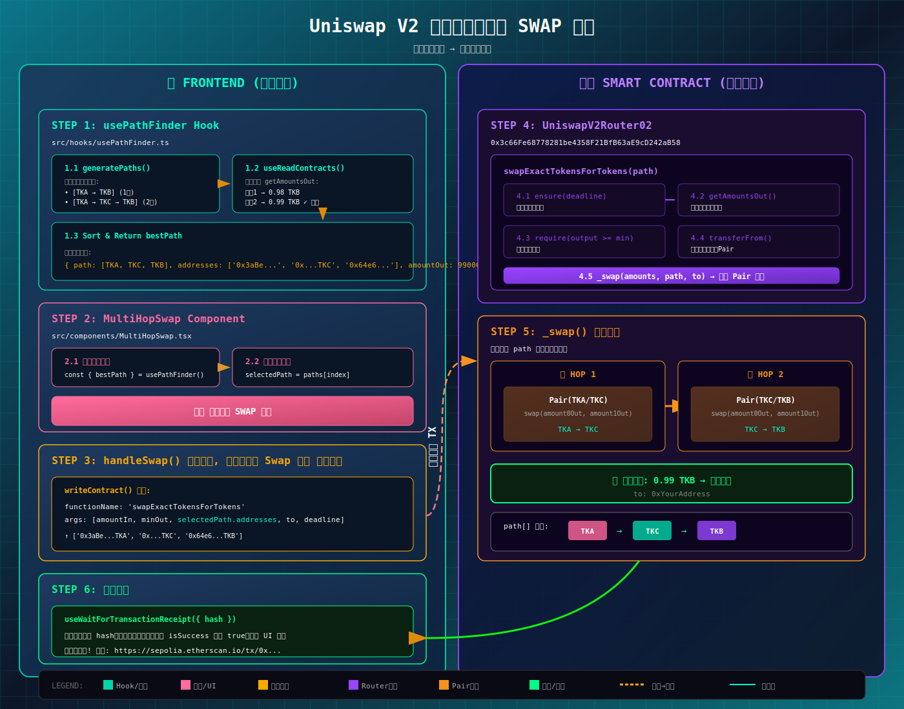

# Uniswap V2 DEX 前端

基于 React + TypeScript + Vite 构建的 Uniswap V2 去中心化交易所前端界面，连接 Sepolia 测试网上已部署的合约。

---

## 目录

1. [项目概述](#1-项目概述)
2. [技术栈](#2-技术栈)
3. [项目结构](#3-项目结构)
4. [功能说明](#4-功能说明)
5. [多跳 Swap 详解](#5-多跳-swap-详解)
6. [配置项](#6-配置项)
7. [快速启动](#7-快速启动)
8. [二次开发](#8-二次开发)
9. [常见问题](#9-常见问题)

---

## 1. 项目概述

本项目是一个轻量级的 Uniswap V2 DEX 前端，专门用于与自部署的 Uniswap V2 合约交互。

### 核心功能

| 功能 | 组件 | 描述 |
|------|------|------|
| **Swap 兑换** | `SwapPermit2.tsx` / `MultiHopSwap.tsx` | 支持多跳路径自动发现（最多 4 跳） |
| **添加流动性** | `AddLiquidityPermit2.tsx` / `AddLiquidity.tsx` | 创建/添加流动性池 |
| **移除流动性** | `RemoveLiquidityPermit2.tsx` / `RemoveLiquidity.tsx` | 销毁 LP Token，赎回底层代币 |
| **余额查询** | `TokenBalance.tsx` | 代币余额、LP 持仓、池子储备（紧凑列表视图） |

### 辅助功能（Header 弹窗）

| 功能 | 图标 | 描述 |
|------|------|------|
| **水龙头** | 💧 | 一键领取 5 种测试代币（每种 1000 个） |
| **WETH 包装** | 🏦 | ETH ↔ WETH 转换 |
| **设置** | ⚙️ | Permit2/传统模式切换 |

### 已配置的合约地址 (Sepolia 测试网)

| 合约 | 地址 |
|------|------|
| Factory | `0x9A267db279FE7d11138f9293784460Df577c3198` |
| Router | `0x3c66Fe68778281be4358F21BfB63aE9cD242aB58` |
| Permit2Router | `0x23F77d19fA26514C8053958ca8cD95FF73D22372` |
| Permit2 (官方) | `0x000000000022D473030F116dDEE9F6B43aC78BA3` |
| Faucet | `0xf641f31d368B61F366672EB88F3a033ACC5DD27d` |
| WETH | `0x7b79995e5f793A07Bc00c21412e50Ecae098E7f9` |

### 测试代币

| 代币 | 地址 |
|------|------|
| TKA | `0x89349c29eAb08674Ccb243aEf113c28847fB5215` |
| TKB | `0x92e90F895172CDc96BB0985BC56f0cA4874aEd79` |
| TKC | `0x7Ca1a37CD0dE6f2bf06c09Da57bEa14344BfBa25` |
| TKD | `0x4dDCabc42aAF3403e300413F3b8AD909F58785b1` |
| TKE | `0xC479b9504E6B70e7cfD8C6479d83D9b5b0883c6` |

---

## 2. 技术栈

| 技术 | 版本 | 用途 |
|------|------|------|
| **React** | 19.x | UI 框架 |
| **TypeScript** | 5.9.x | 类型安全 |
| **Vite** | 7.x | 构建工具 |
| **Wagmi** | 3.x | React Hooks for Ethereum |
| **Viem** | 2.x | 以太坊交互库 |
| **TanStack Query** | 5.x | 异步状态管理 |

---

## 3. 项目结构

```
frontend/
├── public/                       # 静态资源
├── src/
│   ├── assets/                  # 图片等资源
│   ├── components/              # React 组件
│   │   ├── ConnectWallet.tsx       # 钱包连接 + 水龙头 + WETH + 设置
│   │   ├── TokenBalance.tsx        # 代币余额/LP/储备（紧凑列表）
│   │   ├── SwapPermit2.tsx         # 多跳兑换 (Permit2)
│   │   ├── MultiHopSwap.tsx        # 多跳兑换 (传统模式)
│   │   ├── AddLiquidityPermit2.tsx # 添加流动性 (Permit2)
│   │   ├── AddLiquidity.tsx        # 添加流动性 (传统)
│   │   ├── RemoveLiquidityPermit2.tsx # 移除流动性 (Permit2)
│   │   └── RemoveLiquidity.tsx     # 移除流动性 (传统)
│   ├── hooks/                   # 自定义 Hooks
│   │   └── usePathFinder.ts        # 多跳路径查找（支持 4 跳）
│   ├── config/                  # 配置文件
│   │   ├── contracts.ts            # 合约地址和 ABI
│   │   ├── tokens.ts               # 代币配置（含 WETH）
│   │   └── wagmi.ts                # Wagmi 配置
│   ├── App.tsx                  # 主应用组件
│   ├── App.css                  # 应用样式
│   ├── main.tsx                 # 入口文件
│   └── index.css                # 全局样式
├── package.json                 # 依赖配置
├── tsconfig.json                # TypeScript 配置
├── vite.config.ts               # Vite 配置
└── README.md                    # 本文档
```

---

## 4. 功能说明

### 4.1 钱包连接 (`ConnectWallet.tsx`)

**功能**: 钱包连接 + 水龙头 + WETH 包装 + 设置

**核心 Hooks**:
- `useAccount()` - 获取当前连接的账户
- `useConnect()` - 连接钱包
- `useDisconnect()` - 断开连接
- `useBalance()` - 获取 ETH 余额
- `useReadContract()` - 读取 WETH 余额

**Header 弹窗功能**:

| 按钮 | 功能 | 说明 |
|------|------|------|
| 💧 | 水龙头 | 一键领取 5 种测试代币（TKA/TKB/TKC/TKD/TKE），每种 1000 个 |
| 🏦 | WETH | ETH ↔ WETH 包装/解包，支持 MAX 按钮 |
| ⚙️ | 设置 | Permit2/传统授权模式切换 |

**弹窗设计**:
- 居中模态框
- 点击背景关闭
- 显式关闭按钮 (✕)
- 互斥显示（同时只能打开一个）

---

### 4.2 代币余额 (`TokenBalance.tsx`)

**功能**: 显示代币余额、LP 持仓、池子储备

**三个子页签**:
1. **代币余额** - 显示所有代币余额
2. **LP 代币** - 显示 LP 持仓和份额占比
3. **池子储备** - 显示所有池子的储备量和价格

**UI 设计**:
- 紧凑列表视图（非大卡片）
- 固定高度 320px，超出滚动
- 自定义滚动条样式
- 代币图标（首字母 + 渐变背景）

**核心 Hook**: `useReadContracts()` - 批量读取多个合约

---

### 4.3 Swap 兑换 (`SwapPermit2.tsx` / `MultiHopSwap.tsx`)

**功能**: 多跳路径自动发现和兑换

**两种模式**:
- `SwapPermit2.tsx` - Permit2 模式（推荐，1 次签名 + 1 次交易）
- `MultiHopSwap.tsx` - 传统模式（需要先授权）

**多跳路径查找** (`usePathFinder` Hook):
- 最大跳数：4 跳（5 个代币）
- 自动枚举所有可能路径
- 按输出金额降序排序
- 显示带样式的代币标签路径

**交互流程**:
```
1. 选择输入/输出代币
2. 输入兑换数量
3. 自动查找所有可能路径并计算输出
4. 选择最优路径（或手动选择）
5. Permit2 模式：签名 + 交易；传统模式：授权 + 交易
```

**关键参数**:
- `amountIn` - 输入数量
- `amountOutMin` - 最小输出 (滑点保护)
- `path` - 兑换路径（可多跳）
- `deadline` - 交易截止时间

**滑点设置**: 默认 0.5%

---

### 4.4 添加流动性 (`AddLiquidityPermit2.tsx` / `AddLiquidity.tsx`)

**功能**: 向池子添加代币对，获得 LP Token

**两种模式**:
- `AddLiquidityPermit2.tsx` - Permit2 模式（推荐，单次签名覆盖两个代币）
- `AddLiquidity.tsx` - 传统模式（需要分别授权两个代币）

**交互流程 (Permit2)**:
```
1. 输入 Token A 和 Token B 数量
2. 首次使用：授权代币给 Permit2（一次性）
3. 签名（免 gas，Batch 签名同时覆盖两个代币）
4. 发送交易
5. 获得 LP Token
```

**调用函数**: `Permit2Router.addLiquidityWithPermit2Batch()`

**参数说明**:
| 参数 | 说明 |
|------|------|
| tokenA, tokenB | 代币地址 |
| amountADesired | 期望添加的 A 数量 |
| amountBDesired | 期望添加的 B 数量 |
| amountAMin | 最小接受的 A 数量 |
| amountBMin | 最小接受的 B 数量 |
| to | LP Token 接收地址 |
| deadline | 交易截止时间戳 |

---

### 4.5 移除流动性 (`RemoveLiquidityPermit2.tsx` / `RemoveLiquidity.tsx`)

**功能**: 销毁 LP Token，赎回底层代币

**两种模式**:
- `RemoveLiquidityPermit2.tsx` - Permit2 模式
- `RemoveLiquidity.tsx` - 传统模式

**交互流程**:
```
1. 输入要移除的 LP Token 数量
2. 授权 LP Token 给 Router
3. 调用 removeLiquidity
4. 收到 Token A 和 Token B
```

**调用函数**: `Router.removeLiquidity()`

---

## 5. 多跳 Swap 详解

### 5.1 什么是多跳 Swap？

当两个代币之间没有直接的交易对时，可以通过中间代币进行多次兑换：

```
直接路径:  TKA → TKB (1 跳)
多跳路径:  TKA → TKC → TKB (2 跳)
多跳路径:  TKA → TKC → TKD → TKB (3 跳)
```

### 5.2 最优路径选择

**重要**: 最优路径选择是在**前端/链下**计算的，不是在合约里实现。

| 层级 | 职责 |
|------|------|
| **前端** | 枚举所有可能路径 → 调用 `getAmountsOut` → 比较输出 → 选择最优 |
| **合约** | 只执行指定路径的 Swap |

### 5.3 核心代码位置

| 功能 | 文件 | 行号 |
|------|------|------|
| 路径生成 | `src/hooks/usePathFinder.ts` | `generatePaths()` |
| 批量查询输出 | `src/hooks/usePathFinder.ts` | `useReadContracts()` |
| 路径排序 | `src/hooks/usePathFinder.ts` | `validPaths.sort()` |
| 构建交易 | `src/components/MultiHopSwap.tsx` | `handleSwap()` 第 61-73 行 |
| 等待确认 | `src/components/MultiHopSwap.tsx` | `useWaitForTransactionReceipt()` 第 39 行 |

### 5.4 完整交易时序图

```
用户点击 Swap 按钮
      ↓
handleSwap() 调用 writeContract({...})
      ↓
isPending = true (等待用户确认)
      ↓
MetaMask 弹窗
      ↓
用户点击确认
      ↓
MetaMask 签名并广播交易到区块链
      ↓
返回 hash = "0x1234..."
      ↓
data (hash) 被更新
      ↓
useWaitForTransactionReceipt 自动开始监听 hash
      ↓
isConfirming = true (每 4 秒轮询一次)
      ↓
区块链确认交易
      ↓
isSuccess = true
      ↓
显示 "✅ 交易成功!"
```

### 5.5 交易状态变化

| 阶段 | `hash` | `isPending` | `isConfirming` | `isSuccess` |
|------|--------|-------------|----------------|-------------|
| 初始 | `undefined` | false | false | false |
| 用户点击 Swap | `undefined` | **true** | false | false |
| 用户确认后 | `"0x1234..."` | false | **true** | false |
| 链上确认 | `"0x1234..."` | false | false | **true** |

### 5.6 Hash 返回流程

```
writeContract() 
    ↓
Wagmi 调用 wallet_sendTransaction
    ↓
MetaMask 弹窗，用户确认
    ↓
MetaMask 签名并广播到网络
    ↓
网络返回交易哈希 (0x...)
    ↓
MetaMask 返回给 Wagmi
    ↓
useWriteContract 的 data 字段更新
    ↓
useWaitForTransactionReceipt 自动监听
```

### 5.7 交易监听机制

`useWaitForTransactionReceipt` 使用**轮询**方式监听交易状态：

```typescript
const { isSuccess } = useWaitForTransactionReceipt({
  hash,
  confirmations: 1,        // 等待几个区块确认，默认 1
  pollingInterval: 4000,   // 轮询间隔（毫秒），默认 4 秒
  timeout: 60_000,         // 超时时间（毫秒）
});
```

**为什么默认 4 秒？**

| 网络 | 出块时间 | 推荐轮询间隔 |
|------|----------|--------------|
| Ethereum/Sepolia | ~12 秒 | 4 秒 |
| Polygon | ~2 秒 | 1 秒 |
| Arbitrum | ~0.25 秒 | 0.5 秒 |

### 5.8 交易确认的底层原理

**核心问题**: 前端如何知道交易执行成功了？

**答案**: 通过轮询 RPC 节点的 `eth_getTransactionReceipt` 方法。

#### 轮询流程

```
1. 前端发送交易 → 获得 hash = "0x1234..."

2. useWaitForTransactionReceipt 开始轮询：
   每 4 秒调用一次: eth_getTransactionReceipt(hash)

3. RPC 节点返回结果：
   - 交易还在 pending → 返回 null → 继续轮询
   - 交易已被打包 → 返回 receipt 对象 → 停止轮询
```

#### Receipt 返回结构

```json
{
  "transactionHash": "0x1234...",
  "blockNumber": "0x1234567",
  "status": "0x1",           // ← 关键字段！1=成功，0=失败
  "gasUsed": "0x5208",
  "logs": [...]              // 事件日志
}
```

#### 判断成功的依据

| `status` 值 | 含义 | `isSuccess` |
|-------------|------|-------------|
| `"0x1"` (1) | 交易执行成功 | `true` |
| `"0x0"` (0) | 交易执行失败（revert） | `false` |
| `null` | 交易还未被打包 | 继续轮询 |

#### 简化代码示意

```typescript
// Wagmi/Viem 内部实现（简化版）
async function waitForReceipt(hash: string) {
  while (true) {
    // 调用 RPC 节点
    const receipt = await rpcClient.request({
      method: 'eth_getTransactionReceipt',
      params: [hash]
    });
    
    if (receipt !== null) {
      // 交易已被打包到区块
      if (receipt.status === '0x1') {
        return { isSuccess: true };  // ← 成功
      } else {
        return { isSuccess: false }; // ← 失败（revert）
      }
    }
    
    // 还没打包，等 4 秒后再查
    await sleep(4000);
  }
}
```

#### 完整轮询时序

```
用户确认交易
      ↓
MetaMask 广播交易到网络
      ↓
返回 hash = "0x1234..."
      ↓
┌─────────────────────────────────────────┐
│  useWaitForTransactionReceipt 轮询循环   │
├─────────────────────────────────────────┤
│                                         │
│  第 1 次: eth_getTransactionReceipt     │
│           → null (还在 pending)         │
│           → 等待 4 秒                    │
│                                         │
│  第 2 次: eth_getTransactionReceipt     │
│           → null (还在 pending)         │
│           → 等待 4 秒                    │
│                                         │
│  第 3 次: eth_getTransactionReceipt     │
│           → { status: "0x1", ... }      │
│           → 交易成功！停止轮询           │
│                                         │
└─────────────────────────────────────────┘
      ↓
isSuccess = true
      ↓
UI 显示 "✅ 交易成功!"
```

#### 关键点总结

1. **不是实时推送**: 是前端主动去问 RPC 节点
2. **判断依据**: `receipt.status === "0x1"` 表示成功
3. **区块确认**: 交易被打包进区块 = 被矿工/验证者执行并记录
4. **失败情况**: 如果合约 `require()` 失败，`status` 会是 `"0x0"`

### 5.9 前端 → 合约数据流

```
┌─────────────────────────────────────────────────────────────────┐
│                        前端 (链下)                               │
├─────────────────────────────────────────────────────────────────┤
│                                                                 │
│  1. usePathFinder Hook                                          │
│     ├── generatePaths() 生成所有可能路径                         │
│     ├── useReadContracts() 批量调用 getAmountsOut               │
│     └── sort() 按输出排序，返回最优路径                          │
│                                                                 │
│  2. MultiHopSwap 组件                                           │
│     ├── selectedPath = bestPath                                 │
│     └── 用户点击 Swap 按钮                                       │
│                                                                 │
│  3. handleSwap()                                                │
│     └── writeContract({                                         │
│           functionName: 'swapExactTokensForTokens',             │
│           args: [amountIn, minOut, path[], to, deadline]        │
│         })                                                      │
│                              ↓ 发送交易                          │
└──────────────────────────────┼──────────────────────────────────┘
                               ↓
┌──────────────────────────────┼──────────────────────────────────┐
│                        合约 (链上)                               │
├──────────────────────────────┼──────────────────────────────────┤
│                              ↓                                  │
│  4. Router.swapExactTokensForTokens(path)                       │
│     ├── ensure(deadline) 验证未过期                              │
│     ├── getAmountsOut() 计算每跳输出                             │
│     ├── require(output >= min) 滑点保护                          │
│     └── _swap() 执行多跳                                         │
│                              ↓                                  │
│  5. _swap() 循环执行                                             │
│     ├── HOP 1: Pair(TKA/TKC).swap() → 输出 TKC                  │
│     └── HOP 2: Pair(TKC/TKB).swap() → 输出 TKB 到用户            │
│                                                                 │
└─────────────────────────────────────────────────────────────────┘
```

### 5.10 流程图

- 详细的前后端交互流程图



---

## 6. 配置项

### 6.1 合约配置 (`src/config/contracts.ts`)

```typescript
// 修改合约地址
export const CONTRACTS = {
  FACTORY: '0x...', // Factory 合约地址
  ROUTER: '0x...',  // Router 合约地址
  WETH: '0x...',    // WETH 地址
  TOKEN_A: '0x...', // 代币 A 地址
  TOKEN_B: '0x...', // 代币 B 地址
  PAIR: '0x...',    // 交易对地址
};
```

### 6.2 网络配置 (`src/config/wagmi.ts`)

```typescript
import { sepolia, mainnet } from 'wagmi/chains';

export const config = createConfig({
  chains: [sepolia], // 支持的链，可添加 mainnet 等
  connectors: [injected()],
  transports: {
    [sepolia.id]: http(), // 可配置自定义 RPC
  },
});
```

**切换到主网**:
```typescript
import { mainnet } from 'wagmi/chains';

export const config = createConfig({
  chains: [mainnet],
  transports: {
    [mainnet.id]: http('https://eth-mainnet.g.alchemy.com/v2/YOUR_KEY'),
  },
});
```

---

## 7. 快速启动

### 7.1 环境要求

- Node.js >= 18.x
- npm >= 9.x
- MetaMask 浏览器插件

### 7.2 安装依赖

```bash
cd frontend
npm install
```

### 7.3 启动开发服务器

```bash
npm run dev
```

访问 http://localhost:5173

### 7.4 构建生产版本

```bash
npm run build
```

构建产物位于 `dist/` 目录

### 7.5 预览生产版本

```bash
npm run preview
```

---

## 8. 二次开发

### 8.1 添加新代币

1. 在 `contracts.ts` 中添加代币地址:
```typescript
export const CONTRACTS = {
  // ...existing
  TOKEN_C: '0x...' as const,
};
```

2. 在组件中使用新代币地址

### 8.2 添加新功能组件

1. 在 `src/components/` 下创建新组件
2. 使用 Wagmi Hooks 与合约交互:

```typescript
import { useReadContract, useWriteContract } from 'wagmi';

export function MyComponent() {
  // 读取合约
  const { data } = useReadContract({
    address: CONTRACTS.ROUTER,
    abi: ROUTER_ABI,
    functionName: 'myFunction',
    args: [...],
  });

  // 写入合约
  const { writeContract } = useWriteContract();
  
  const handleAction = () => {
    writeContract({
      address: CONTRACTS.ROUTER,
      abi: ROUTER_ABI,
      functionName: 'myFunction',
      args: [...],
    });
  };
}
```

### 8.3 自定义样式

样式文件位于 `src/App.css`，采用 CSS 变量和渐变色设计:

```css
/* 主色调 */
.btn-primary {
  background: linear-gradient(90deg, #ff6b9d, #c44569);
}

/* 卡片样式 */
.card {
  background: rgba(255, 255, 255, 0.05);
  backdrop-filter: blur(10px);
}
```

### 8.4 添加新网络

在 `wagmi.ts` 中添加:

```typescript
import { sepolia, polygon, arbitrum } from 'wagmi/chains';

export const config = createConfig({
  chains: [sepolia, polygon, arbitrum],
  transports: {
    [sepolia.id]: http(),
    [polygon.id]: http(),
    [arbitrum.id]: http(),
  },
});
```

### 8.5 常用 Wagmi Hooks

| Hook | 用途 |
|------|------|
| `useAccount()` | 获取当前账户 |
| `useConnect()` | 连接钱包 |
| `useDisconnect()` | 断开钱包 |
| `useReadContract()` | 读取单个合约 |
| `useReadContracts()` | 批量读取合约 |
| `useWriteContract()` | 写入合约 |
| `useWaitForTransactionReceipt()` | 等待交易确认 |
| `useBalance()` | 获取 ETH 余额 |

---

## 9. 常见问题

### Q1: 连接钱包后显示错误网络

**解决**: 在 MetaMask 中切换到 Sepolia 测试网

### Q2: 交易失败 "INSUFFICIENT_ALLOWANCE"

**解决**: 需要先授权代币给 Router 合约

### Q3: 交易失败 "EXPIRED"

**解决**: deadline 参数过期，代码中已设置为 30 分钟后

### Q4: 如何获取 Sepolia 测试币

- [Alchemy Faucet](https://sepoliafaucet.com/)
- [Infura Faucet](https://www.infura.io/faucet/sepolia)

### Q5: 如何部署到生产环境

```bash
# 构建
npm run build

# 部署 dist/ 目录到:
# - Vercel
# - Netlify
# - GitHub Pages
# - 任意静态托管服务
```

---

## 相关链接

- [Uniswap V2 合约文档](../DEPLOYMENT.md)
- [Wagmi 文档](https://wagmi.sh/)
- [Viem 文档](https://viem.sh/)
- [Sepolia Etherscan](https://sepolia.etherscan.io/)

---

## License

MIT
