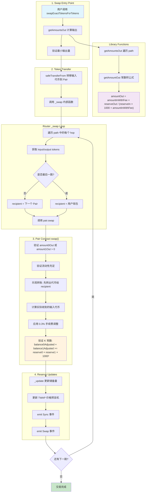
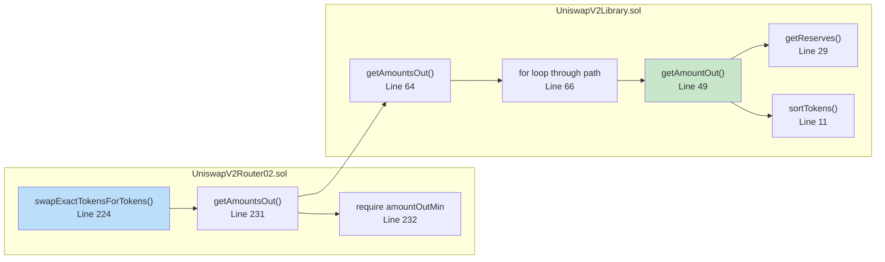
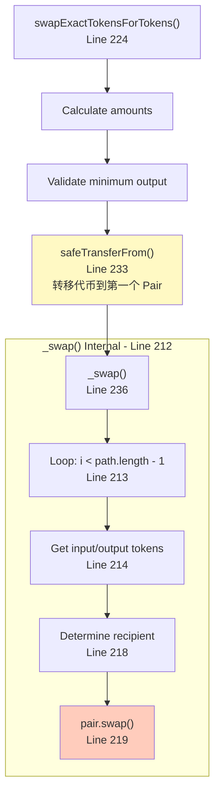
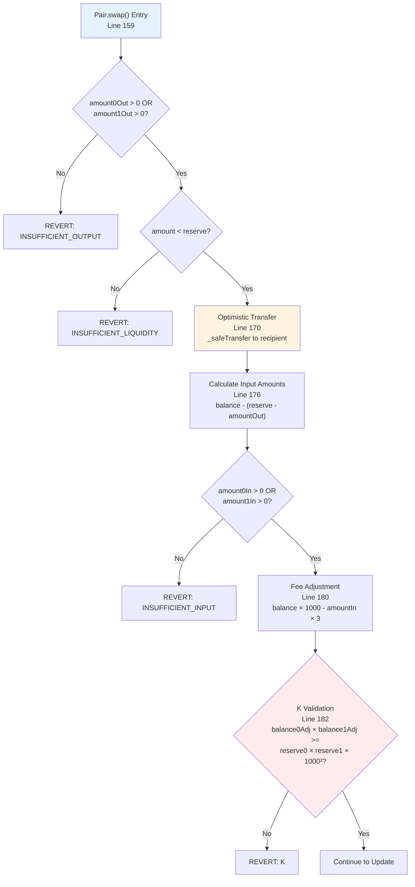
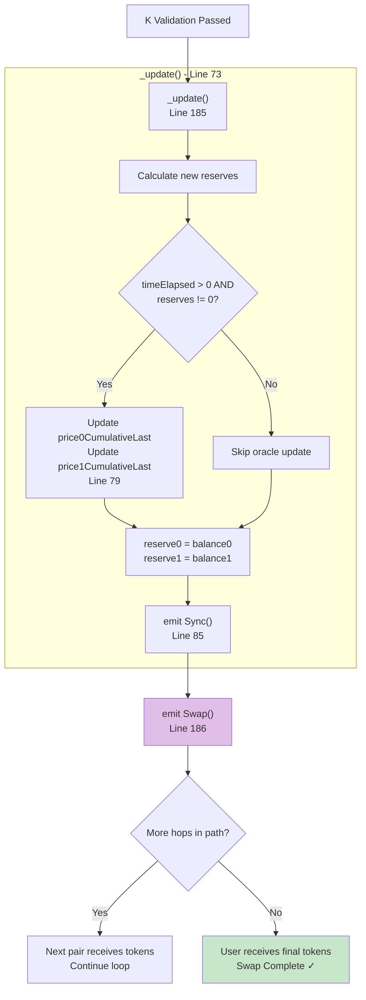

# Uniswap V2 Swap Mechanism: From Router02 to Pair Contract

## 完整流程图



## 详细流程图 - 按 Trace 分解

### Trace 1: Swap Entry Point and Path Calculation



### Trace 2: Token Transfer and Swap Initiation



### Trace 3: Core Pair Contract Swap Logic



### Trace 4: Reserve Updates and Swap Completion



## 关键代码位置索引

| 步骤 | 文件 | 行号 | 描述 |
|------|------|------|------|
| 入口 | UniswapV2Router02.sol | 224 | swapExactTokensForTokens() |
| 计算 | UniswapV2Router02.sol | 231 | getAmountsOut() |
| 验证 | UniswapV2Router02.sol | 232 | require amountOutMin |
| 转账 | UniswapV2Router02.sol | 233 | safeTransferFrom() |
| 循环 | UniswapV2Router02.sol | 213 | _swap() loop |
| Pair调用 | UniswapV2Router02.sol | 219 | pair.swap() |
| 输出验证 | UniswapV2Pair.sol | 160 | require output > 0 |
| 乐观转账 | UniswapV2Pair.sol | 170 | _safeTransfer() |
| 输入计算 | UniswapV2Pair.sol | 176 | balance change |
| 手续费 | UniswapV2Pair.sol | 180 | 0.3% fee |
| K验证 | UniswapV2Pair.sol | 182 | constant product |
| 更新储备 | UniswapV2Pair.sol | 185 | _update() |
| 事件 | UniswapV2Pair.sol | 186 | emit Swap() |

## 常数积公式

```
amountOut = (amountIn × 997 × reserveOut) / (reserveIn × 1000 + amountIn × 997)
```

其中 `997/1000` 代表扣除 0.3% 手续费后的比例。
